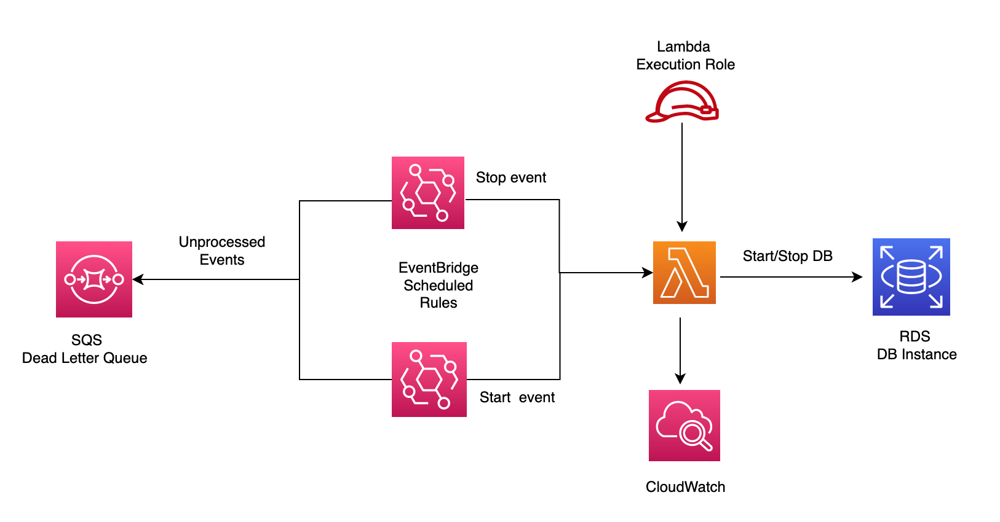
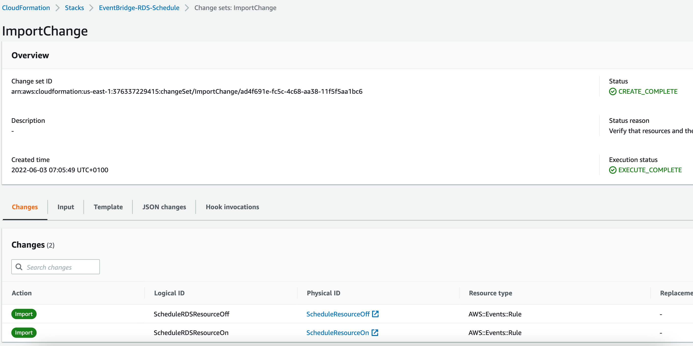
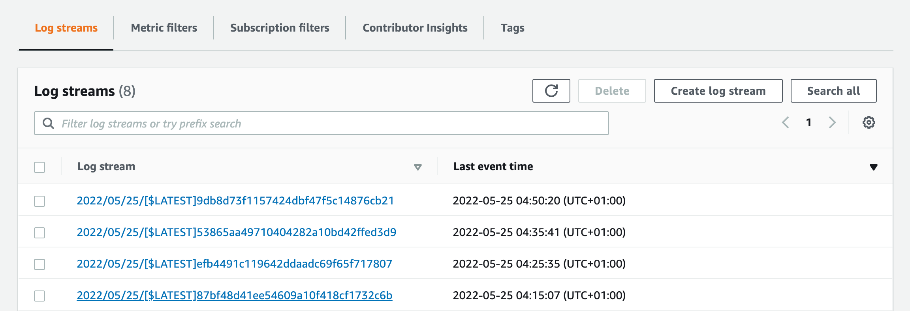
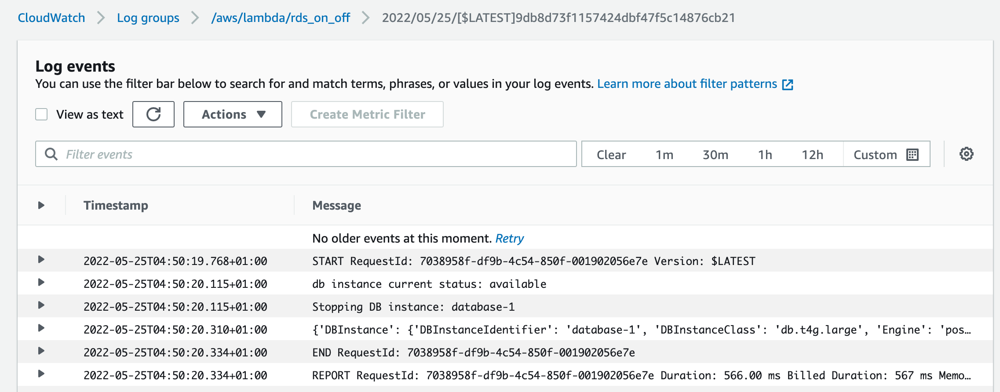

## Scheduling starting and stopping RDS instances



I found this [Tutorial Dojo article](https://tutorialsdojo.com/automatically-stop-non-production-rds-databases-with-aws-lambda-and-amazon-eventbridge/) and [AWS blog](https://aws.amazon.com/blogs/database/schedule-amazon-rds-stop-and-start-using-aws-lambda/) on automated solutions for stopping/starting RDS instances with EventBridge and Lambda very interesting so I thought I will use a more programmatic approach to implelment this which may benefit others (via aws cli and cloudformation templates) instead of configuring via the console [1][2]. In this demo, we will schedule an RDS Postgres DB instance in a single AZ. This could also be extended to multiple instances but beyond the scope of this example. We will assume the db instance needs to be made available from 1-5pm from 25-31 May 2022.
Furthermore, this example could also be modified to tackle this [issue](https://aws.amazon.com/premiumsupport/knowledge-center/rds-stop-seven-days/#:~:text=If%20you%20don't%20manually,system%2C%20or%20database%20engine%20version.
) of rds restarting automatically 7 days after it was last stopped (for maintenance jobs)

### Creating lambda function

* Create the Lambda function that will start or stop the RDS instances. If using the console,
  select Python3.9 as the runtime. Under Execution role, select Create a new role. This 
  will create a basic role with logging permissions to cloudwatch. This will be need to be adapted in the next step
  to also allow access to rds. Finally, click Create function.

* Navigate to the role created in the previous step and edit the permissions policy
  attached to the role so it looks like `rds_on_off-role-permissions.json`
  
* Replace the hello world sample code in the lambda function, with lambda_packages/rds_on_off/lambda_function.py. This uses the 
  describe_db_instance API to find the current state of the instance in the region. It’s also important to note that the stop_db_instance API is incapable of turning o

### Creating Eventbridge scheduled rules


#### Using Cloudformation Templates

Resources required for this workflow are EventBridge Rules, lambda and RDS. Each of these can be created
using the cloudformation templates `lambdas_rds_and_firehose_only.yaml`, `rds.yaml` and 
`multi_resource_templates/eventbridge_schedule.yaml`  e.g. to setup the default postgres engine

```shell
$ aws cloudformation create-stack --stack-name RDS --template-body file://cloudformation/rds.yaml \
--parameters ParameterKey=DBUsername,ParameterValue=<username> ParameterKey=DBPassword,ParameterValue=<password>
```

If stack needs to be created from existing resources, then run the following bash script.
This takes in three args corresponding to the EventBridge Rule state (ENABLED or DISABLED), on schedule time and off schedule time
which can be modified accordingly - note the example below sets the on/odd schedule to 18:00/19:00 everyday 
in May 2022.
This will create a change set, shoe the changes to be made and then prompt the user if wants to proceed ('y') or not ('n')
based on the changes shown. If yes, then it will execute the changeset. If no, then the change set created
will be deleted and script exited.

```shell
sh data-migration/import_rules_lambda_rds.sh ENABLED "cron(00 18 * 5 ? 2022)" "cron(00 19 * 5 ? 2022)"

Creating change set for EventRuleSchedule Stack ....
{
    "Id": "arn:aws:cloudformation:us-east-1:376337229415:changeSet/ImportChange/840104f9-4e43-4763-a919-46d61a9585cf",
    "StackId": "arn:aws:cloudformation:us-east-1:376337229415:stack/EventBridge-RDS-Schedule/7ac23370-e302-11ec-a6a8-0aff63d29381"
}
Wait 15 secs before showing changes in change set description .......

Showing resources to be created in change set
{
    "Changes": [
        {
            "Type": "Resource",
            "ResourceChange": {
                "Action": "Import",
                "LogicalResourceId": "ScheduleRDSResourceOff",
                "PhysicalResourceId": "ScheduleResourceOff",
                "ResourceType": "AWS::Events::Rule",
                "Scope": [],
                "Details": []
            }
        },
        {
            "Type": "Resource",
            "ResourceChange": {
                "Action": "Import",
                "LogicalResourceId": "ScheduleRDSResourceOn",
                "PhysicalResourceId": "ScheduleResourceOn",
                "ResourceType": "AWS::Events::Rule",
                "Scope": [],
                "Details": []
            }

Do you wish to execute change set? y

Executing change set as requested
```




#### From Console

* On the Amazon EventBridge console, click Create rule. Under Rule detail, enter ScheduleResourceOn as the rule name, 
  leave Event bus as default and select the Schedule rule type. Click Next.

* Write the desired CRON expression. For example, below we want to trigger the Lambda function every 1 PM BST (UTC+1) from 
   25-31 May 2022, we set it to  "00 17 25-31 5 ? 2022". In eventbridge the cron job is in UTC, so needs to be set at 
  12 PM. Click Next.


* Specify the 'rds_on_off' Lambda function as a target. We will also configure target input - in additional 
  settings > configure target input, select Constant (JSON text) from drop-down and insert 
  the json below in the box. In the Click Next > Next > Create Rule
  
```
{
  "rds_required_state": "stopped",
  "rds_instance_id": "database-1"
}
```

* Optionally, we may want to send unprocessed events for failed target invocatiosn to SQS. 
  We need to create a Dead-letter queue in SQS first  as explained in the [video](  https://docs.aws.amazon.com/eventbridge/latest/userguide/eb-rule-dlq.html )
  Once thats done, select existing SQS to be used as dead letter queue - and select the one created from dropdown. 
  Then Click Next > Next > Create Rule 


* Create the second event rule ScheduleResourceOff that will trigger the rds_on_off function. Repeat steps above as a guide. 
  However, this time,replace the CRON expression with "00 17 25-31 5 ? 2022" to stop the RDS instance at 5 PM UTC (6 PM BST) every day from  
  25-31 May 2022.
  
#### Monitoring

In case the scheduled event, has failed to start or stop the instance, we can investigate 
the cloudwatch logs. 

* Navigate to the logstreams for the lambda function. 



* investigate the logstream corresponding to the event time 




* we can also check the SQS dead queue (if event bridge was configured to send any unprocessed events) in cases
  where the lamdba function was not invoked [3]. EventBridge publishes an event to Amazon CloudWatch metrics 
  indicating that a target invocation failed.  Additional metrics are sent to CloudWatch including InvocationsSentToDLQ
  if DLQ is set. 

### References
1. Tutorials Dojo Article on AWS Lambda and Amazon EventBridge to automatically stop/start RDS instances https://tutorialsdojo.com/automatically-stop-non-production-rds-databases-with-aws-lambda-and-amazon-eventbridge/
2. AWS Blog on workflow for automatically stopping/starting RDS instances https://aws.amazon.com/blogs/database/schedule-amazon-rds-stop-and-start-using-aws-lambda/
3. Eventbridge dead letter queues https://docs.aws.amazon.com/eventbridge/latest/userguide/eb-rule-dlq.html
