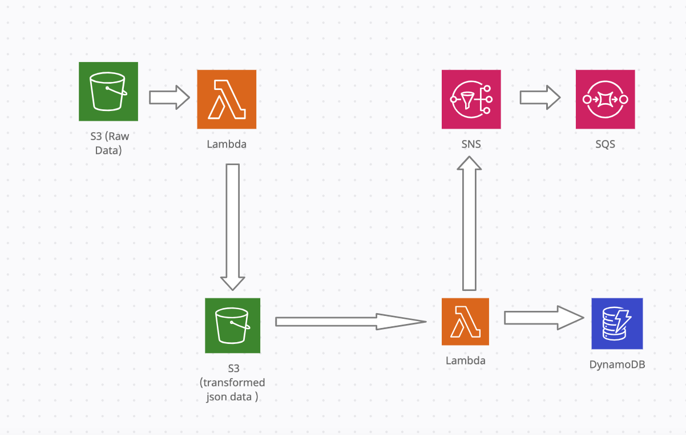
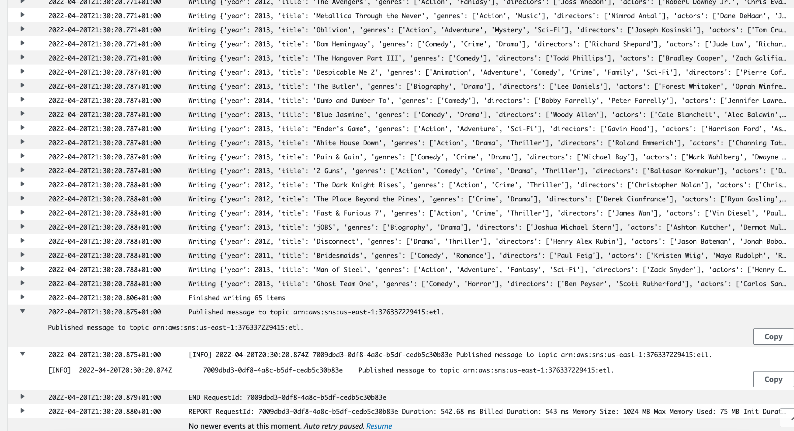

# Copy data from S3 to dynamodb



The code for the lambda packages can be found [here](https://github.com/ryankarlos/AWS-ETL-Workflows/tree/master/lambda_packages/batch_write_s3_dynamodb/)
[here](https://github.com/ryankarlos/AWS-ETL-Workflows/tree/master/lambda_packages/ddb_input_transform/)
Zip the lambda function script and required modules into package by running the following commands

First cd into the `batch_write_s3_dynamodb` directory where all the modules are stored. Then run the following command to
add the modules to zip outside the current directory

```Shell
$ zip -r ../batch_write_dynamodb.zip .
 
  adding: lambda_function.py (deflated 54%)
  adding: ddb_io.py (deflated 61%)
  adding: schema.py (deflated 68%)
 
```

Then repeat the same for the `ddb_input_transform` package. Then we can deploy the two lambda functions with the following configurations from console or cli

* **Timeout**: 40,
* **MemorySize**: 1024
* **Runtime**: python3.9,


From the cli, we can run the following command for deploying each function. We would need to create a role for lambda to assume 
and attach a policy giving it permissions to access data from, write to DynamoDB and publishing to SNS.
The policy json example can be viewed in the respective folders [here](https://github.com/ryankarlos/AWS-ETL-Workflows/tree/master/s3_to_dynamodb/iam_permissions)

```Shell
 aws lambda create-function --function-name <function-name> --runtime python3.9 --zip-file fileb://<path-to-source-code-zip> \
    --role <role-arn> --timeout 40 --memory-size 1024 --handler lambda_function.lambda_handler
```


if you update the source code, you will need to update the lambda function with new zip 

```
$ aws lambda update-function-code --function-name batch_write_s3_dynamodb --zip-file fileb://batch_write_dynamodb.zip


{
    "FunctionName": "batch_write_s3_dynamodb",
    "FunctionArn": "<arn>:function:batch_write_s3_dynamodb",
    "Runtime": "python3.9",
    "Role": "<arn>/batch_write_s3_dynamodb-role-ms0y29fp",
    "Handler": "lambda_function.lambda_handler",
    "CodeSize": 3057,
    "Description": "",
    "Timeout": 300,
    "MemorySize": 1024,
    "LastModified": "2022-04-19T03:25:33.000+0000",
    "CodeSha256": "1rZsGrHJCjLIYKOu+7sXlIyAV0MBO9F5ZeE447EieL4=",
    "Version": "$LATEST",
    "TracingConfig": {
        "Mode": "PassThrough"
    },
    "RevisionId": "da80b102-e870-439c-8d77-942a5d0e110f",
    "State": "Active",
    "LastUpdateStatus": "InProgress",
    "LastUpdateStatusReason": "The function is being created.",
    "LastUpdateStatusReasonCode": "Creating",
    "PackageType": "Zip"
}
```


## SNS and SQS

Create SNS topic as described [here](https://docs.aws.amazon.com/sns/latest/dg/sns-create-topic.html)

Attach resource policy to the SNS as in data-pipelines/s3_dynamodb/iam_permissions/sns
In this example, I have broadened it to allow a number of services to publish to SNS (as will
be using same policy for other uses cases) but best to adapt to adhere to least privilege principle.
Will also allow any SQS or email protocol to subscribe to SNS.

Create standard SQS queue as described [here](https://docs.aws.amazon.com/AWSSimpleQueueService/latest/SQSDeveloperGuide/sqs-configure-create-queue.html)
Adjust max retention period to determine after what period, messages are purged from the queue. 
Click edit queue and attach resource policy as in  data-pipelines/s3_dynamodb/iam_permissions/sqs
This should allow SNS resources to publish to SQS.

In SNS console, create subscription for SNS topic arn created and add protocol 'sqs' and endpoint for the queue created previously. 
Tick 'enable raw message delivery box' so  all SNS metadata is stripped from message [Ref](https://docs.aws.amazon.com/sns/latest/dg/sns-large-payload-raw-message-delivery.html)

Test that SNS receives messages from SNS by publishing test message in SNS topic console.


If this is working, then we should see the messages published from the [lambda function](https://github.com/ryankarlos/AWS-ETL-Workflows/blob/master/lambda_packages/batch_write_s3_dynamodb/index.py)
into SNS appear in the queue in SQS

### Creating resource automatically with CloudFormation

The DynamoDb, SNS topic and two lambda functions required in the workflow can also be created 
automatically via cloudformation templates using [cloudformation](cloudformation). The templates required and 
commands to run will depend on whether we need to create the stack from scratch with resources not 
previosuly created or if we already have stacks created but want to move resources 
between one and the other.

#### Scenario 1 - Creating new stack with all resources

If not created any resource previously, then the CloudFormation template [s3_dynamodb_with_lambda_import.yaml](https://github.com/ryankarlos/AWS-ETL-Workflows/blob/master/cloudformation/multi_resource_templates/s3_dynamodb_with_lambda_import.yaml) 
will create the DynamoDb, SNS and two lambda functions required in the workflow using the the command below 

```Shell
$ aws cloudformation create-stack --stack-name S3toDynamo --template-body file://cloudformation/multi_resource_templates/s3_dynamodb_with_lambda_import.yaml
```

#### Scenario 2 - Resources already exist in another stack and need to be imported

Assume we have Stack A in which lambda resources have  already been created using  the following [template](https://github.com/ryankarlos/AWS-ETL-Workflows/blob/master/cloudformation/lambdas.yaml) and  
stack B in which S3 and DynamoDB resources are created using [template](https://github.com/ryankarlos/AWS-ETL-Workflows/blob/master/cloudformation/multi_resource_templates/s3_dynamodb.yaml) 
We then need to follow this section in the [AWS docs](https://docs.aws.amazon.com/AWSCloudFormation/latest/UserGuide/refactor-stacks.html) to move 
required lambda resources from source stack A to target stack B.

* Add `DeletionPolicy: "Retain"` to lambdas resource properties in source template `cloudformation/lambdas.yaml`
  (if not already included) and update stack 
  
```Shell
$ aws cloudformation update-stack --stack-name Lambdas --template-body file://cloudformation/lambdas.yaml
```

* Remove the lambda resources from source template `cloudformation/lambdas.yaml` which need to be imported into target 
  stack. The final template after modification would look like `cloudformation/lambdas_rds_and_firehose_only.yaml`.
  Update the stack again - this would remove the resources from stack but will not delete them (due to `DeletionPolicy: "Retain"`
  added to the template) and they will still be available for import later into target stack

```Shell
$ aws cloudformation update-stack --stack-name Lambdas --template-body file://cloudformation/lambdas_rds_and_firehose_only.yaml

```

* Create Change Set of type import for stack B and link to resources import template `resources_to_import/lambdas.txt`
and modified target template with required lambda resources added `cloudformation/multi_resource_templates/s3_dynamodb_with_lambda_import.yaml.yaml`

```Shell
$ aws cloudformation create-change-set --stack-name S3toDynamo --change-set-name StackwithLambdas --change-set-type IMPORT --resources-to-import file://cloudformation/resources_to_import/lambdas.txt --template-body file://cloudformation/multi_resource_templates/s3_dynamodb_with_lambda_import.yaml
```

* Describe changeset to check changes and then execute changeset if satsifed with the changes.

```
$ aws cloudformation describe-change-set --stack-name S3toDynamo --change-set-name StackwithLambdas

    "Changes": [
        {
            "Type": "Resource",
            "ResourceChange": {
                "Action": "Import",
                "LogicalResourceId": "batchwrites3dynamo",
                "PhysicalResourceId": "batch_write_s3_dynamodb",
                "ResourceType": "AWS::Lambda::Function",
                "Scope": [],
                "Details": []
            }
        },
        {
            "Type": "Resource",
            "ResourceChange": {
                "Action": "Import",
                "LogicalResourceId": "ddbinputtransform",
                "PhysicalResourceId": "ddb_input_transform",
                "ResourceType": "AWS::Lambda::Function",
                "Scope": [],
                "Details": []
            }
        }
    ],
```

```
$ aws cloudformation execute-change-set --stack-name S3toDynamo --change-set-name StackwithLambdas
```

### Running end to end with bash script


To run all the above and also put json object into S3 to trigger lambda function, run the 
bash script below with the params : raw data path, lambda function name, S3 bucket name, object key
The script assumes the two lambda functions are named _ddb_input_transform_ and _batch_write_s3_dynamodb_
and S3 buckets exists with name _movies-data-json_ and subfolders with paths _s3://movies-data-json/raw/_ and
_s3://movies-data-json/transformed_

SNS topic would also need to be created beforehand and named 'etl'

e.g. 

```Shell
$ chmod +x s3_to_dynamodb/bash_scripts/update_lambda_and_trigger.sh
$ sh s3_to_dynamodb/bash_scripts/update_lambda_and_trigger.sh \
ddb_input_transform batch_write_s3_dynamodb datasets/moviedata.json
```

or without any params defaults to the param values above

```
$ sh s3_to_dynamodb/bash_scripts/update_lambda_and_trigger.sh 

 Running s3 to dynamo batch write script
Zipping lambda package for ddb_input_transform
updating: __init__.py (stored 0%)
updating: lambda_function.py (deflated 44%)
updating: transform.py (deflated 59%)

Zipping lambda package for batch_write_s3_dynamodb
updating: __init__.py (stored 0%)
updating: ddb_io.py (deflated 57%)
updating: lambda_function.py (deflated 52%)
updating: schema.py (deflated 68%)

 ddb_input_transform function already exists so updating with zip source code 
{
    "FunctionName": "ddb_input_transform",
    "FunctionArn": "<arn>,
    "Runtime": "python3.9",
    "Role": "<arn-prefix>/batch_write_s3_dynamodb-role-ms0y29fp",
    "Handler": "lambda_function.lambda_handler",
    "CodeSize": 1366,
    "Description": "",
    "Timeout": 40,
    "MemorySize": 1024,
    "LastModified": "2022-04-20T16:28:46.000+0000",
    "CodeSha256": "OG5C4MsQ0QJAIJmx5WJr5VWXDM6B+6FdF2BP4g9WoQQ=",
    "Version": "$LATEST",
    "TracingConfig": {
        "Mode": "PassThrough"
    },
    "RevisionId": "4f10d7d1-a02c-4968-bc6a-a2028a22d32c",
    "State": "Active",
    "LastUpdateStatus": "InProgress",
    "LastUpdateStatusReason": "The function is being created.",
    "LastUpdateStatusReasonCode": "Creating",

 batch_write_s3_dynamodb function already exists so updating with zip source code 
{
    "FunctionName": "batch_write_s3_dynamodb",
    "FunctionArn": "<arn>",
    "Runtime": "python3.9",
    "Role": "<arn-prefix>/batch_write_s3_dynamodb-role-ms0y29fp",
    "Handler": "lambda_function.lambda_handler",
    "CodeSize": 2807,
    "Description": "",
    "Timeout": 300,
    "MemorySize": 1024,
    "LastModified": "2022-04-20T16:28:51.000+0000",
    "CodeSha256": "pK79sDp290GhQK9xj26bMQ1XxaUZc24HdkG7Urk2kSg=",
    "Version": "$LATEST",
    "TracingConfig": {
        "Mode": "PassThrough"
    },
    "RevisionId": "6ad57a6c-a456-4f74-b92b-4bb3615a0d78",
    "State": "Active",
    "LastUpdateStatus": "InProgress",
    "LastUpdateStatusReason": "The function is being created.",
    "LastUpdateStatusReasonCode": "Creating",

 put object in S3 to trigger lambda execution 
{
    "ETag": "\"d80d1246eb741b95bdef7e99fb4db5c6\""
}
```


## Cloudwatch Execution logs 
In the cloudwatch console you can see the lamda function execution logs

* **/aws/lambda/ddb_input_transform** log group

first Lambda function performs data transformations and triggered by raw data load into S3


* **/aws/lambda/batch_write_s3_dynamodb** log group

Second lambda function triggered by S3 put event and batch writing data to DynamoDB and publish to SNS topic **etl**




## SQS message delivery

Polls one or more messages (up to 10), from the specified queue.[Reference](https://docs.aws.amazon.com/cli/latest/reference/sqs/receive-message.html)

```
$aws sqs receive-message --queue-url <sqs-queue-url> --attribute-names All --message-attribute-names All --max-number-of-messages 10
{
    "Messages": [
        {
            "MessageId": "4be01ca7-888e-461f-9500-4fc1ae4337b6",
            "ReceiptHandle": "AQEBU3PtDASje/SBVMr/oHrRMkY/bPJIq09ERfgJWnlGirMEY6iyqgLs7Z7pHzBK6L0DbuGwY6I10TtbhHOs/NAhdgGRNL9gspHk5tvBlk7ejuAQ0NhxvjvgwVKq60pntdTt6bIlPLblBL54yqAiqRPp4t8gz58S6JdeIU2Oagrda9yuzUzpb83o/UZoAaohD2b6t1RfnQgGBldqcuti7RYH1u4yEIY9rWW5LjKDvUiCkConphOQTFuBAi27QJHdAcwVHh1tEmLTLhe6HXN5TSX+V2M0LlFLDvY8FGVCDZ4MfHrG/JjD2s8Z/6xcPXaXmCCX8cb/iJ4aBQKkssYlrUWS7fCHy7/4sTNqdNzDvF+6z3qQTYFhPwf+51Tioe30QS6k",
            "MD5OfBody": "19a34c72a8de23921a228b8a7f93be51",
            "Body": "Successfully written 65 items to dynamo db movies",
            "Attributes": {
                "SenderId": "AIDAIT2UOQQY3AUEKVGXU",
                "ApproximateFirstReceiveTimestamp": "1650497744806",
                "ApproximateReceiveCount": "1",
                "SentTimestamp": "1650497725499"
            }
        }
    ]
}
```