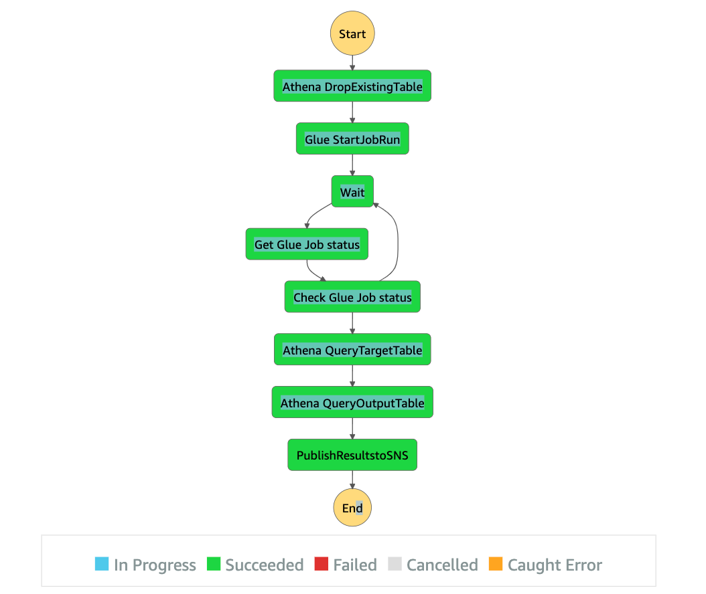

# Step Function for Running Glue Job

Before running this example, we have to create a glue job based on the following [script](https://github.com/ryankarlos/AWS-ETL-Workflows/blob/master/glue_etl/example1/script.py)
and following the instructions [here](https://docs.aws.amazon.com/glue/latest/dg/console-custom-created.html).
For the worker type choose 'Standard' and we will use 4 workers.

You will also need to create an IAM role and attach the following policies:
- arn:aws:iam::aws:policy/AmazonS3FullAccess 
- arn:aws:iam::aws:policy/AWSGlueConsoleFullAccess
- arn:aws:iam::aws:policy/CloudWatchLogsFullAccess

This example uses the [definition](https://github.com/ryankarlos/AWS-ETL-Workflows/blob/master/step_functions/definitions/glue_etl.json) to start the glue job, 
wait for job to complete, then query athena table and finally publish number of rows to SNS

 

Once we have created the glue job, we can create the state machine based on this definition by running commmand listed [here](https://docs.aws.amazon.com/cli/latest/reference/stepfunctions/create-state-machine.html)
and supplying definition value as json

Get the step function arn, by running the following [command](https://docs.aws.amazon.com/cli/latest/reference/stepfunctions/start-execution.html
) to list the step functions arn.

Then execute statemachine using the following command and pass arn retrieved earlier for state machine created.

```shell
$ aws stepfunctions start-execution --state-machine-arn <arn>

{
    "executionArn": "arn:aws:states:us-east-1:376337229415:execution:ETLDemo:905b2d8e-e659-4e18-ba1f-714882100324",
    "startDate": "2022-04-21T02:37:21.064000+01:00"
}
```

We can check status of the execution


```shell
$ aws stepfunctions describe-execution --execution-arn "arn:aws:states:us-east-1:376337229415:execution:ETLDemo:905b2d8e-e659-4e18-ba1f-714882100324"


{
    "executionArn": "<arn>",
    "stateMachineArn": "<arn>",
    "name": "905b2d8e-e659-4e18-ba1f-714882100324",
    "status": "FAILED",
    "startDate": "2022-04-21T02:37:21.064000+01:00",
    "stopDate": "2022-04-21T02:38:18.965000+01:00",
    "input": "{}",
    "inputDetails": {
        "included": true
    },
    "traceHeader": "Root=1-6260b551-db5653e799449c7169fc982b;Sampled=1"
}
```

If failed, we can retrieve execution history. Command below does this in reverse order and only
prints out two items (so we get the latest event that failed) and the cause for failure.

```shell
$ aws stepfunctions get-execution-history  --execution-arn <enter-arn> --no-include-execution-data --reverse-order --max-items 2

{
    "events": [
        {
            "timestamp": "2022-04-21T02:38:18.965000+01:00",
            "type": "ExecutionFailed",
            "id": 9,
            "previousEventId": 0,
            "executionFailedEventDetails": {
                "error": "States.Runtime",
                "cause": "An error occurred while executing the state 'Glue StartJobRun' (entered at the event id #8). 
                The JSONPath '$.JobName' specified for the field 'JobName.$' could not be found in the input '{}'"
            }
        },
        {
            "timestamp": "2022-04-21T02:38:18.965000+01:00",
            "type": "TaskStateEntered",
            "id": 8,
            "previousEventId": 7,
            "stateEnteredEventDetails": {
                "name": "Glue StartJobRun"
            }
        }
    ],
    "NextToken": "eyJuZXh0VG9rZW4iOiBudWxsLCAiYm90b190cnVuY2F0ZV9hbW91bnQiOiAyfQ=="
}

```

This error is because the input json `{"JobName": "flights_s3_to_s3"}` was not passed via `--input` argument.
The GlueStartJob  task requires JSONPath '$.JobName' from the input as defined in the state-machine definition.
